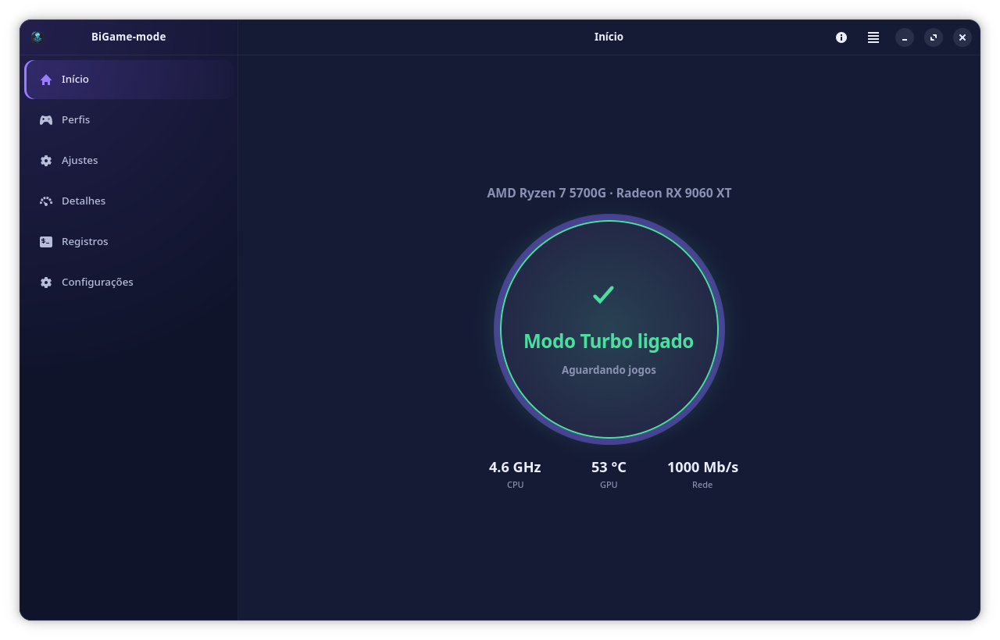
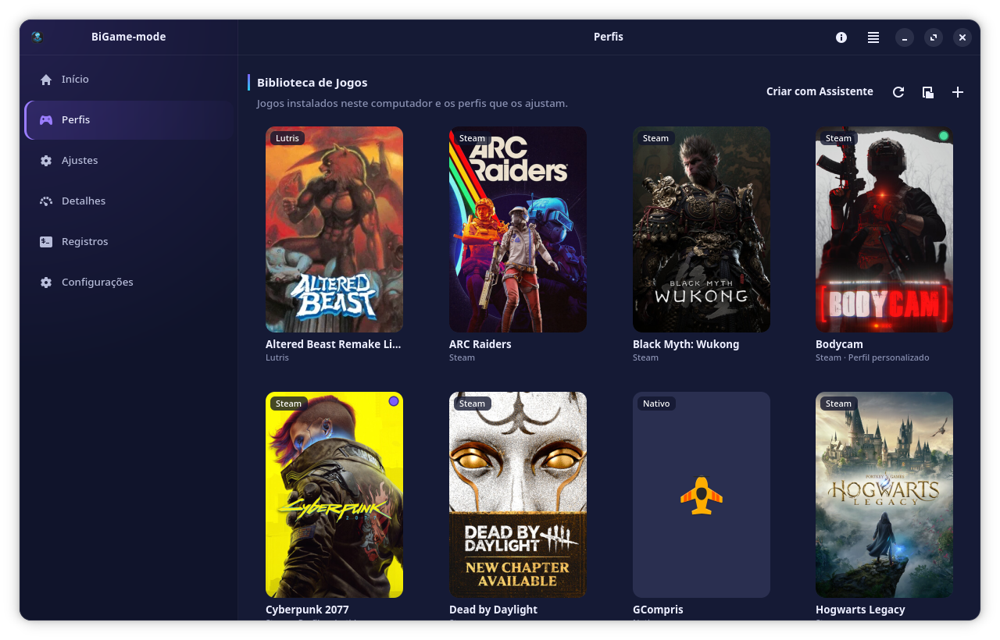
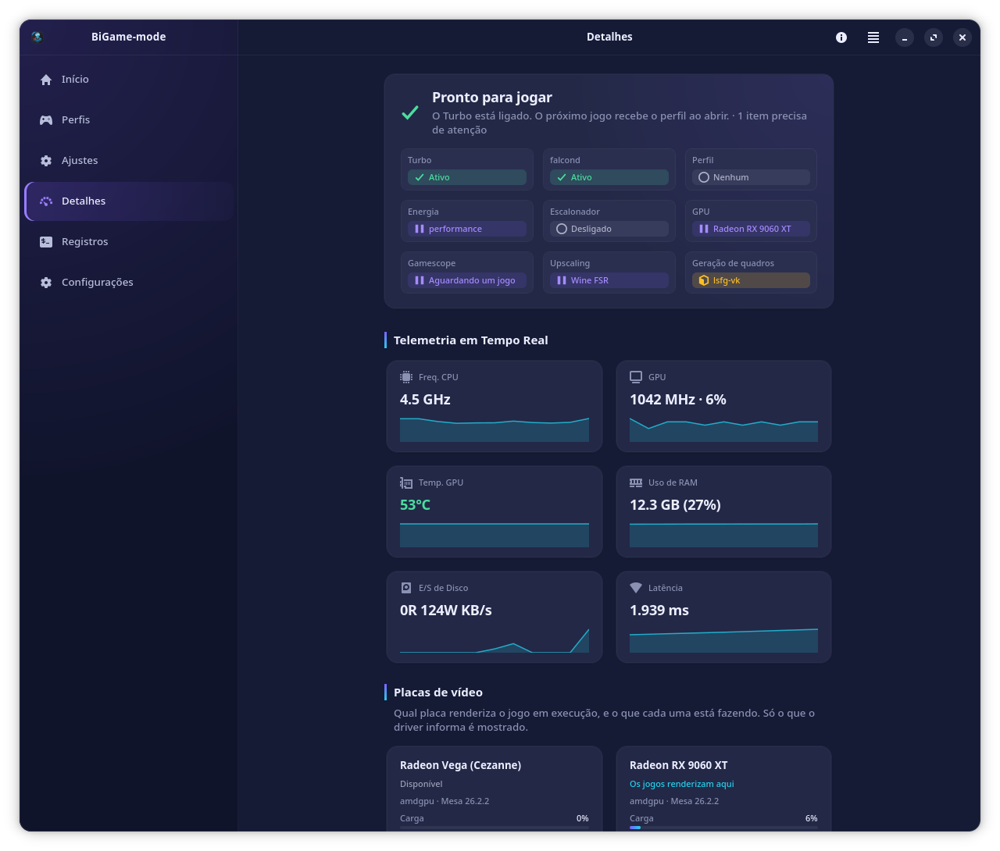
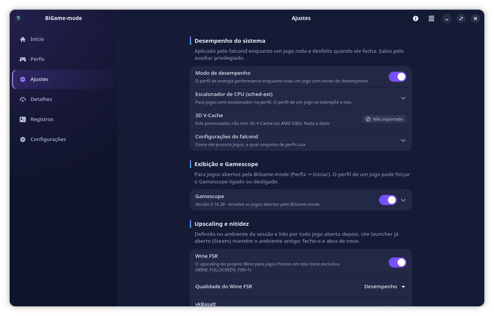
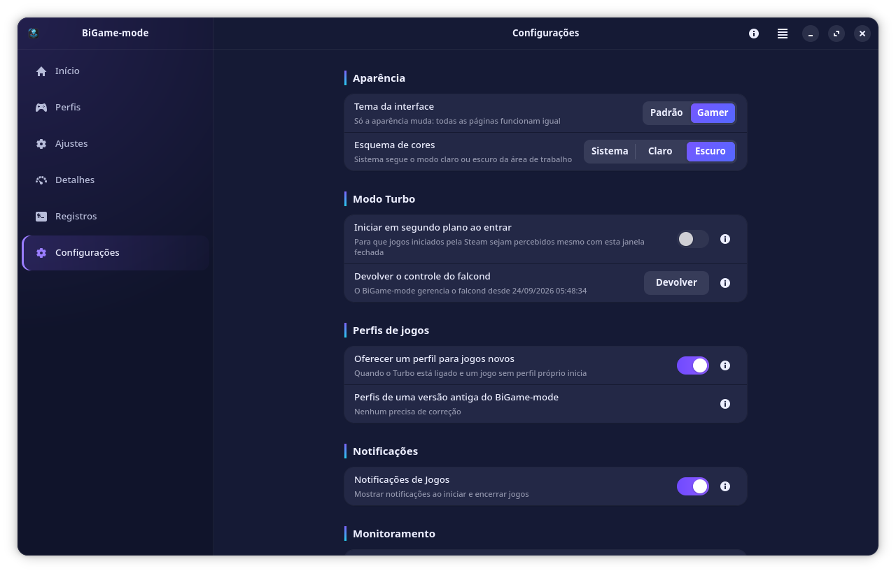
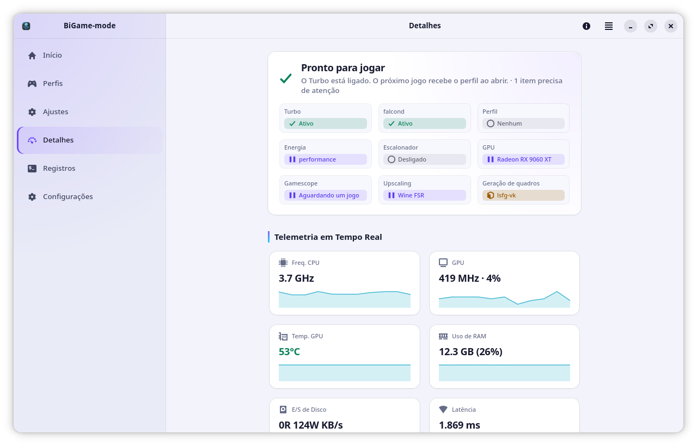
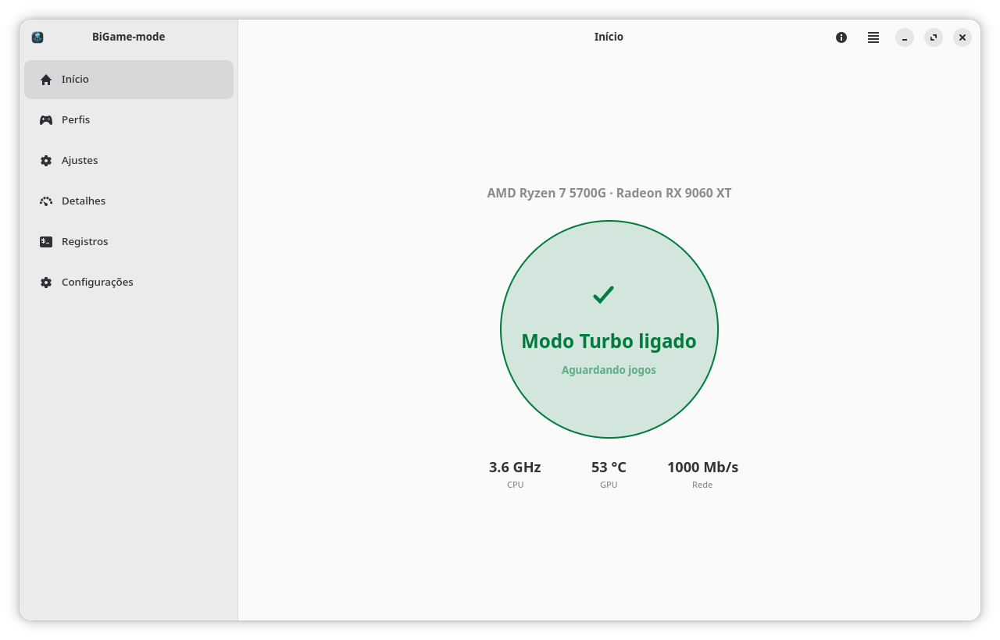

<div align="center">


# BiGame-mode

**O modo de jogo do BigLinux.**<br>
Turbo com um clique, perfis por jogo, Gráficos com IA e uma página que mostra,
com evidência, o que está mesmo em vigor.

[](https://github.com/ruscher/bigamemode)
[](LICENSE)
[](https://www.rust-lang.org/)
[](https://gnome.pages.gitlab.gnome.org/libadwaita/)
[](#-idiomas)

[Recursos](#-recursos) ·
[Capturas de tela](#-capturas-de-tela) ·
[Instalação](#-instalação) ·
[Benchmarks](#-benchmarks) ·
[Segurança](#%EF%B8%8F-segurança) ·
[Desenvolvimento](#%EF%B8%8F-desenvolvimento)

<br>

<picture>
  <source media="(prefers-color-scheme: light)" srcset="docs/screenshots/home-default-light.png">
  
</picture>

</div>

---

## 🎮 O que é

O BiGame-mode é a central de jogos do BigLinux. Com um botão, o **Turbo**, os
jogos passam a rodar com o perfil de desempenho certo, aplicado ao abrir e
desfeito ao fechar pelo [falcond](https://git.pika-os.com/general-packages/falcond).
O aplicativo mostra o que de fato está em vigor, mede se uma mudança ajudou e
cuida do que acontece *dentro* do jogo, como o upscaling e a geração de quadros,
sempre com backup e desfazer completos.

> [!NOTE]
> Uma regra atravessa o projeto: **nada é oferecido que a máquina não possa
> fazer, e nada é chamado de melhoria sem medição.**

## 🚀 Novidades da 2.0.0

- **Seis páginas** (Início, Perfis, Ajustes, Detalhes, Registros e
  Configurações). **Detalhes** mostra o que está realmente em vigor e a
  evidência de cada item.
- **FSR 4 pelo Proton.** Num jogo que já traz o FSR 3.1 da AMD, os
  **Gráficos com IA** o elevam ao FSR 4 com uma única opção de execução, sem
  tocar em arquivo nenhum.
- Os **upscalers que jogos da Unreal Engine trazem como plugins** agora são
  encontrados.
- **MangoHud por jogo**, gravado onde o lançador do jogo o lê (Steam, Heroic
  ou Lutris).
- **Tema Gamer** ao lado do Padrão, claro, escuro ou o do sistema.
- **29 idiomas.** O aplicativo é escrito em inglês e todo texto, inclusive as
  mensagens de erro, é traduzível e está traduzido.
- **Sandbox mais rígido** para o auxiliar privilegiado: `/sys` somente leitura,
  exceto os dispositivos.
- Wine FSR e vkBasalt desligados passam a valer na sessão em execução, e um
  falcond que já estava rodando é reconhecido pelo seu estado.

## ✨ Recursos

<table>
<tr>
<td width="50%" valign="top">

### ⚡ Turbo

A chave principal. Desligado, o BiGame-mode não interfere em jogo nenhum.
Ligado, o falcond aplica o perfil de cada jogo (perfil de energia, escalonador
sched-ext, modo do 3D V-Cache, inibição de repouso) e restaura tudo quando o
jogo fecha.

</td>
<td width="50%" valign="top">

### 🕹️ Perfis por jogo

Jogos do Steam, Lutris, Heroic e do menu de aplicativos (nativos e Flatpak).
Só aparecem os que estão mesmo instalados. Quando um jogo desconhecido abre com
o Turbo ligado, uma notificação oferece criar o perfil, com um assistente que
explica cada opção.

</td>
</tr>
<tr>
<td valign="top">

### 🤖 Gráficos com IA

Analisa o jogo: a API gráfica, o DLSS/XeSS/FSR que ele já traz, as DLLs de
proxy, o anti-cheat e a GPU em que ele renderiza. Depois recomenda um plano.
Só ao clicar em **Aplicar** ele instala o OptiScaler com backup verificado ou
eleva o FSR 3.1 ao FSR 4 pelo Proton. Também oferece **Reparar**,
**Restaurar** e **Diagnosticar**.

</td>
<td valign="top">

### 🔍 Detalhes com evidência

Cada item diz se está **ativo**, **aguardando**, **configurado mas não
detectado**, **desligado**, **sem dependência** ou **não suportado**. Ao abrir
a linha, você vê o que isso significa, a evidência e a correção. A página
também traz telemetria em tempo real, um cartão por GPU e **Problemas**
classificados, com comandos para copiar.

</td>
</tr>
<tr>
<td valign="top">

### 🎛️ Ajustes honestos

Desempenho do sistema, exibição e Gamescope, upscaling e nitidez (Wine FSR e
vkBasalt), geração de quadros (lsfg-vk), overlay e opções avançadas. O que a
máquina não pode fazer aparece como **não suportado** ou **dependência
ausente**, com o comando que resolve. Nunca aparece um controle quebrado.

</td>
<td valign="top">

### 📏 Medir a diferença

Compara o jogo com e sem otimizações em várias execuções alternadas e dá o
veredito com o teste t de Welch. Uma melhoria só é chamada assim quando
supera a variação.

</td>
</tr>
</table>

<details>
<summary><b>Tudo o que cada página faz</b></summary>

| Página | O que faz |
|---|---|
| **Início** | O **Turbo**, o processador e a GPU, o jogo em execução, o perfil ativo, o estado dos Gráficos com IA e um resumo da telemetria (CPU, GPU, rede). |
| **Perfis** | A biblioteca de jogos com capas. Cada perfil define o modo de desempenho, o escalonador sched-ext, o modo do 3D V-Cache, a inibição de repouso, o Gamescope, o MangoHud (desligado, ligado ou forçado) e o lsfg-vk. No menu ⋮ de cada jogo: **Iniciar (Turbo)**, **Criar com Assistente**, **Gráficos com IA**, **Medir a diferença** e **Restaurar os gráficos do jogo**. |
| **Ajustes** | Tudo o que é aplicado aos jogos, em grupos progressivos. Dois upscalers ligados ao mesmo tempo são apontados, e um clique resolve. |
| **Detalhes** | Visão geral (pronto para jogar, Turbo, falcond, perfil, energia, escalonador, GPU, Gamescope, upscaling, geração de quadros), telemetria em tempo real, um cartão por placa de vídeo (carga, clock, VRAM, temperatura, energia e qual renderiza o jogo), o desempenho e o pipeline de vídeo. Traz ainda os **Problemas**, a rede, a carga em segundo plano, as opções de lançamento da Steam quebradas e o relatório para suporte. |
| **Registros** | O que importa numa sessão de jogo, vindo do journal: falcond, BiGame-mode, power-profiles-daemon, scx_loader, Gamescope e os drivers de GPU. |
| **Configurações** | A aparência (tema **Padrão** ou **Gamer**, claro, escuro ou o do sistema; uma instalação nova abre em Gamer escuro), o início em segundo plano, a oferta de perfis, as notificações e **Devolver**, que entrega o falcond exatamente como estava antes. |

Fechar a janela deixa o aplicativo na **bandeja**. A cor do ícone indica o
estado: azul quando ocioso, verde com um jogo otimizado e amarelo quando há
um aviso.

</details>

## 📸 Capturas de tela

<table>
<tr>
<td width="50%"></td>
<td width="50%"></td>
</tr>
<tr>
<td align="center"><b>Perfis</b>: a biblioteca de jogos instalados, cada um com seu perfil</td>
<td align="center"><b>Detalhes</b>: o que está em vigor, com a evidência</td>
</tr>
<tr>
<td></td>
<td></td>
</tr>
<tr>
<td align="center"><b>Ajustes</b>: o que a máquina não suporta aparece como tal</td>
<td align="center"><b>Configurações</b>: temas Padrão e Gamer, claro ou escuro</td>
</tr>
<tr>
<td></td>
<td></td>
</tr>
<tr>
<td align="center"><b>Tema Gamer claro</b></td>
<td align="center"><b>Tema Padrão claro</b></td>
</tr>
</table>

## ⚙️ Como funciona

- **O falcond cuida do desempenho do sistema.** Ele reconhece o jogo pelo nome
  do processo, aplica o perfil e restaura tudo quando o jogo fecha. O
  BiGame-mode liga e desliga o falcond (Turbo) e escreve os perfis que ele lê.
- **Cada ajuste tem um único dono.** O BiGame-mode não aplica por conta própria
  o que o falcond ou o power-profiles-daemon já aplicam. O GameMode da Feral
  não é usado, porque os dois disputariam os mesmos ajustes.
- **Duas tecnologias com a mesma função não rodam em série.** Num jogo com
  OptiScaler, o Wine FSR e o upscaling do Gamescope ficam desligados naquela
  execução. O lsfg-vk também fica desligado quando o OptiScaler gera os
  quadros.
- **Os Gráficos com IA detectam o que o jogo realmente usa** pela tabela de
  importação do executável, não pelo nome das DLLs. Eles nunca tocam jogos com
  anti-cheat e baixam o [OptiScaler](https://github.com/optiscaler/OptiScaler)
  da release oficial, por HTTPS e com SHA-256 fixado.
- **Cada instalação é uma transação**: backup verificado, diário, troca atômica
  e verificação. Uma instalação interrompida é desfeita na próxima abertura.
- O BiGame-mode **não redistribui binários de terceiros** nem baixa ou
  substitui DLLs da NVIDIA. A renderização neural em AMD (DLSS-NR-on-AMD) é
  detectada e explicada, mas nunca baixada, porque a licença não permite.

## 🛡️ Segurança

```text
┌─────────────────────────┐   D-Bus (sistema)   ┌─────────────────────────┐
│ bigame-ui    (usuário)  │ ──────────────────▶ │ bigame-daemon   (root)  │
│ GTK4 + libadwaita, tray │  cada chamada passa │ valida cada argumento;  │
│ Gráficos com IA,        │  pelo Polkit        │ perfis e config do      │
│ medições, registros     │                     │ falcond, Turbo, sysfs   │
└───────────┬─────────────┘                     └───────────┬─────────────┘
            │ lê o estado                                   ▼
            └──────────────────────────────▶ falcond ──▶ scx_loader,
                                             (perfis)    power-profiles-daemon
```

- **A interface nunca roda como root.** Só um pequeno auxiliar no barramento de
  sistema tem privilégios.
- **Nove métodos privilegiados**, cada um autorizado pelo Polkit antes de
  qualquer outra coisa (sem Polkit, o acesso é negado) e com cada argumento
  validado do lado root.
- **Escritas estreitas e atômicas.** Cada método escreve um único local
  conhecido, com `O_EXCL | O_NOFOLLOW`, nunca num caminho montado por quem
  chama. Perfis não aceitam `start_script`/`stop_script`.
- **Confinado pelo systemd.** `/sys` é somente leitura, exceto
  `/sys/devices`. Nenhum comando passa por shell.

Detalhes em [docs/SECURITY.md](docs/SECURITY.md) e
[docs/ARCHITECTURE.md](docs/ARCHITECTURE.md).

## 📦 Instalação

### BigLinux · Manjaro · Arch Linux

**1. Ative o repositório BigCommunity (community-extra).** O `falcond` e o
`lsfg-vk` vêm dele, e ele não vem ativado numa instalação padrão do BigLinux.
O `vkbasalt` vem do repositório do BigLinux (no Arch, do AUR).

```bash
sudo pacman-key --keyserver hkps://keyserver.ubuntu.com \
    --recv-keys AECEEE84E52BBFAA9F1C9DF01EA0CEEEB09B44A3
sudo pacman-key --lsign-key AECEEE84E52BBFAA9F1C9DF01EA0CEEEB09B44A3

sudo tee -a /etc/pacman.conf <<'CONF'

[community-extra]
SigLevel = PackageRequired
Server = https://repo.communitybig.org/extra/$arch
CONF

sudo pacman -Sy
```

**2. Compile e instale o BiGame-mode.**

```bash
sudo pacman -S --needed base-devel git
git clone https://github.com/ruscher/bigamemode.git
cd bigamemode
makepkg -si
```

O `makepkg` instala o que falta para compilar, compila, confere as traduções,
roda os testes e instala o pacote. O PKGBUILD compila a branch `main` do
GitHub, não as mudanças locais do clone.

Depois, abra **BiGame-mode** no menu de aplicativos.

> [!TIP]
> Ao atualizar, o auxiliar para e volta na próxima chamada, já com a versão
> nova. Ao remover, o falcond volta ao estado em que estava antes do
> BiGame-mode. Os arquivos que os Gráficos com IA colocaram em jogos continuam
> lá até **Restaurar os gráficos do jogo**. Os backups ficam em
> `~/.local/state/bigame-mode/graphics`.

### Dependências

| Pacote | Por quê |
|---|---|
| `gtk4`, `libadwaita`, `glib2`, `hicolor-icon-theme` | interface |
| `dbus`, `polkit`, `systemd` | o auxiliar root: serviço no barramento de sistema, iniciado pelo systemd, com cada ação autorizada pelo Polkit |
| `falcond`, `power-profiles-daemon` | desempenho por jogo e perfil de energia |
| `scx-tools`, `scx-scheds` | o `scx_loader`, com que o falcond troca o escalonador de CPU durante o jogo, e os escalonadores |
| `gamescope`, `mangohud`, `vkbasalt` | o que os ajustes por jogo e de lançamento ligam; o MangoHud também captura os frametimes das medições |
| `lsfg-vk` | geração de quadros (Lossless Scaling) por jogo; só gera quadros com o seu próprio `Lossless.dll`, que nunca vem no pacote |
| `curl`, `libarchive` | baixar e extrair o OptiScaler |
| `hwdata`, `pciutils` | identificar a placa de vídeo |
| `iputils`, `iproute2` | latência e fila de rede |

**Opcional:** `nvidia-utils` fornece a telemetria em placas NVIDIA, pela
biblioteca NVML. Só serve a placas NVIDIA e conflita com os pacotes dos
drivers NVIDIA antigos.

Os lançadores **não** são dependências: o BiGame-mode encontra os jogos do
Steam, do Lutris e do Heroic que estiverem instalados, nativos ou em Flatpak.

O pacote instala o `bigame-ui` (o aplicativo, que roda como usuário comum) e o
`bigame-daemon` (o auxiliar root), com sua unit do systemd, os arquivos de
D-Bus e a política do Polkit. Instala também o `.desktop`, o metainfo, os
ícones e as traduções.

## 💻 Compatibilidade

| | |
|---|---|
| **Sistema** | BigLinux e derivados do Manjaro/Arch, com systemd e o falcond do repositório BigCommunity |
| **Área de trabalho** | Testado no KDE Plasma (Wayland). No GNOME, o ícone da bandeja depende de uma extensão AppIndicator |
| **Jogos** | Steam (incluindo Proton), Lutris, Heroic e jogos nativos do menu de aplicativos, nativos ou Flatpak |
| **GPUs** | AMD, NVIDIA e Intel, inclusive notebooks híbridos (a GPU em que o jogo renderiza é identificada, com PRIME offload) |
| **Testado em** | AMD Ryzen 7 5700G com Radeon RX 9060 XT (RDNA 4) e a Radeon Vega integrada; notebook híbrido com Intel HD 630 e GeForce GTX 1050 Ti (driver NVIDIA 580); máquina virtual com BigLinux padrão (instalação do zero, sem aceleração 3D) |
| **Detectado, ainda não testado em hardware real** | RDNA 3, RTX, Intel Arc, CPUs híbridas, 3D V-Cache, notebooks na bateria, X11, VRR e HDR. Nessas máquinas, o BiGame-mode oferece só o que detectar como suportado |

## 📊 Benchmarks

Medido com o benchmark do próprio **Shadow of the Tomb Raider** (3440×1440, três
execuções alternadas por configuração, diferença exigida acima da variação e
no teste t de Welch a 95 %):

| Configuração | FPS médio | |
|---|---:|---|
| TAA nativo do jogo | 89,8 | `████████████████████░░` |
| XeSS Quality do próprio jogo | 94,2 | `█████████████████████░` **+4,9 %** |
| **FSR via OptiScaler (Gráficos com IA)** | **98,8** | `██████████████████████` **+10,1 %** |

- **Cyberpunk 2077**, que traz o FSR 3.1 da AMD: o FSR 4 pelo Proton (uma
  opção de execução, nenhum arquivo) rendeu o mesmo que o FSR 3.1 (38,4 → 38,2,
  sem diferença, duas execuções por configuração). O OptiScaler ficou 6,4 %
  **mais lento**, por isso ali o recomendado é o FSR do próprio jogo.
- **Nível de energia da GPU:** fixar a GPU no nível `high` deixou os jogos
  7,5–8,3 % **mais lentos**. Perfil de energia, governador e escalonadores
  sched-ext não mudaram nada, por isso o BiGame-mode não os força.
- **Geração de quadros:** o lsfg-vk custou 42 % dos quadros renderizados em x2
  (88,9 → 51,8) e 55 % em x3, por isso nunca é ligado sozinho.

Método e todos os resultados em [docs/BENCHMARKS.md](docs/BENCHMARKS.md). Os
dados brutos de cada sessão ficam em `bigame-engine/benchmarks/`.

## 🌍 Idiomas

O BiGame-mode é escrito em inglês e está traduzido para **29 idiomas**:

> alemão · búlgaro · chinês · coreano · croata · dinamarquês · eslovaco ·
> espanhol · estoniano · finlandês · francês · grego · hebraico · holandês ·
> húngaro · inglês · islandês · italiano · japonês · norueguês · polonês ·
> português · português do Brasil · romeno · russo · sueco · tcheco · turco ·
> ucraniano

O idioma segue o do sistema. Os catálogos ficam em [`locale/`](locale).
Correções e novos idiomas são bem-vindos.

## 🛠️ Desenvolvimento

Requer Rust 1.85 ou mais novo, GTK 4.14+, libadwaita 1.7+ e
`glib-compile-resources`.

```bash
cd bigame-engine
cargo build --workspace
cargo test --workspace
cargo clippy --workspace --all-targets -- -D warnings   # lints pedantic
./target/debug/bigame-ui
./target/debug/bigame-ui --diagnostics     # relatório de suporte no terminal
```

O código é um workspace Rust em `bigame-engine/`:

| Crate | Papel |
|---|---|
| `bigame-core` | toda a lógica, sem interface: detecção, perfis, Turbo, Gráficos com IA, telemetria, medições |
| `bigame-ui` | o aplicativo GTK4/libadwaita e o ícone da bandeja |
| `bigame-daemon` | o auxiliar root no D-Bus, autorizado pelo Polkit |

- Sem o pacote instalado, a interface roda, mas o que exige root (perfis,
  Turbo, configuração do falcond) fica indisponível.
- `tests/daemon-authorization.sh` confere que o auxiliar recusa todas as ações
  privilegiadas quando o Polkit não está disponível.
- `bigame-core/examples/` traz ferramentas de linha de comando: detecção
  (`detect`, `library`, `running`, `health`), Gráficos com IA (`graphics_scan`,
  `graphics_plan`, `graphics_apply`, `graphics_status`,
  `graphics_capabilities`, `graphics_diagnose`, `graphics_native`), Turbo e
  Booster (`turbo`, `booster_run`, `measure`), lsfg-vk (`lsfg`) e relatórios
  de benchmark (`bench_report`, `bench_native_report`). Rode com
  `cargo run -p bigame-core --example <nome>`.
- `bigame-engine/scripts/` automatiza sessões de benchmark: `bench-game.sh`
  (jogos com benchmark próprio), `bench-lab.sh` (o benchmark do SuperTuxKart),
  `gpu-telemetry.sh` (amostras da GPU durante uma execução) e `scx-switch.sh`
  (troca de escalonador como root, via pkexec).

<details>
<summary><b>Traduções</b></summary>

Todo texto visível passa por `i18n`/`ni18n` na interface e por `N_` no
`bigame-core`. Depois de mudar textos no código:

```bash
python3 locale/extract-strings.py        # atualiza locale/bigame-mode.pot
for po in locale/*.po; do
    msgmerge -U --no-wrap --no-fuzzy-matching "$po" locale/bigame-mode.pot
done
```

O extrator recusa rodar se um arquivo com textos faltar em
`locale/POTFILES.in`, e o build falha se o template estiver desatualizado.

</details>

## 👤 Autor

<table>
<tr>
<td>

**Rafael Ruscher** · <rruscher@gmail.com>

Eu, **Rafael Ruscher**, sempre fui apaixonado por jogos. Sou um grande
entusiasta e, principalmente, um defensor ferrenho de jogos no Linux. Nos
últimos anos, vimos o jogo virar: com as melhorias constantes e o apoio
massivo da **Valve**, a compatibilidade hoje é quase total.

Fico extremamente feliz em poder jogar com amigos como o **Barnabé di
Kartola**, e acompanhar a turma do **Alessandro** e do **Pacheco** do canal
**System Infotech**. Eles jogam diariamente e, sempre que me sobra um
tempinho, estou lá jogando com eles. Ver canais mostrando o **BigLinux** em
ação me motiva profundamente.

Em respeito a essa comunidade e para garantir que todos tenham a melhor
experiência possível, criei o **BiGame-mode**. O objetivo é aproveitar o
máximo do hardware, trazendo os últimos recursos tecnológicos para alcançar o
FPS máximo. Com a integração do `lsfg-vk` (Lossless Scaling) e o `falcond`,
criamos uma solução completa de GameMode para o ecossistema BigLinux.

**Agradecimentos:** Bruno Gonçalves, Barnabé di Kartola, Alessandro e Pacheco
(System Infotech) e a comunidade BigLinux.

</td>
</tr>
</table>

## 🙏 Projetos utilizados

O BiGame-mode se apoia em projetos de terceiros, cada um com seus autores e
licenças:

- **Sistema:** [falcond](https://git.pika-os.com/general-packages/falcond)
  (PikaOS), [sched-ext](https://github.com/sched-ext/scx) e `scx_loader`,
  power-profiles-daemon, systemd, D-Bus e Polkit.
- **Jogos e gráficos:** [OptiScaler](https://github.com/optiscaler/OptiScaler),
  Gamescope e Proton (Valve), DXVK, VKD3D-Proton,
  [lsfg-vk](https://github.com/PancakeTAS/lsfg-vk), MangoHud e vkBasalt. DLSS,
  XeSS e FSR pertencem a NVIDIA, Intel e AMD e seguem as licenças delas.
- **Aplicativo:** Rust, GTK e libadwaita (GNOME), gtk4-rs, zbus, Tokio, Serde,
  ksni e gettext.

## 📄 Licença

Distribuído sob a **GPL-3.0-or-later**. Veja [LICENSE](LICENSE).

<div align="center">
<sub>Feito com 🎮 para a comunidade <b>BigLinux</b>.</sub>
</div>
