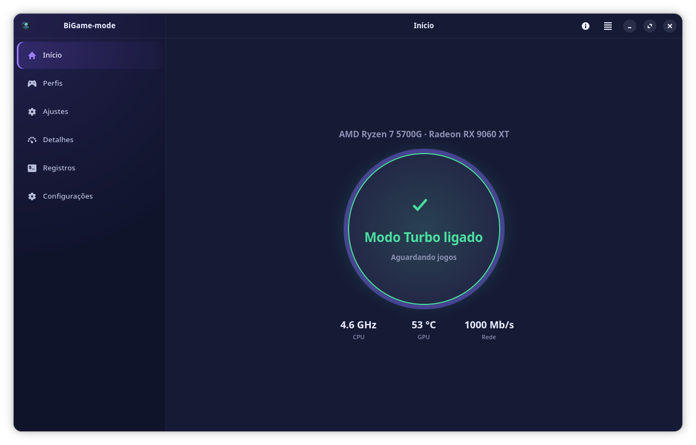
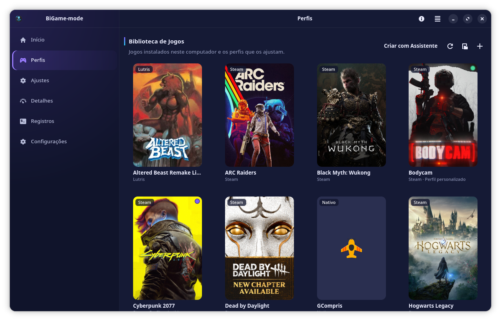
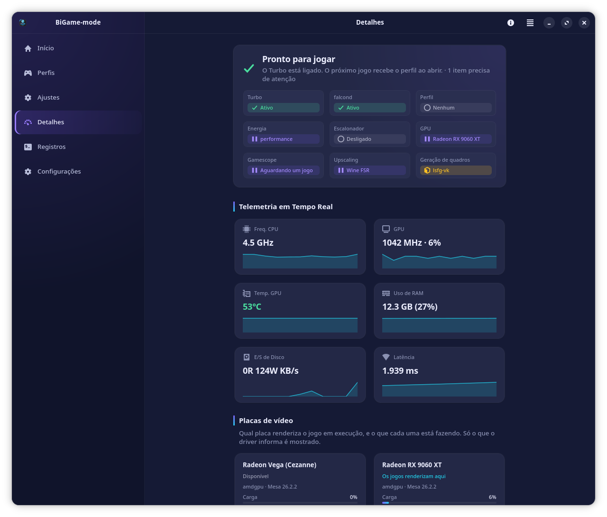
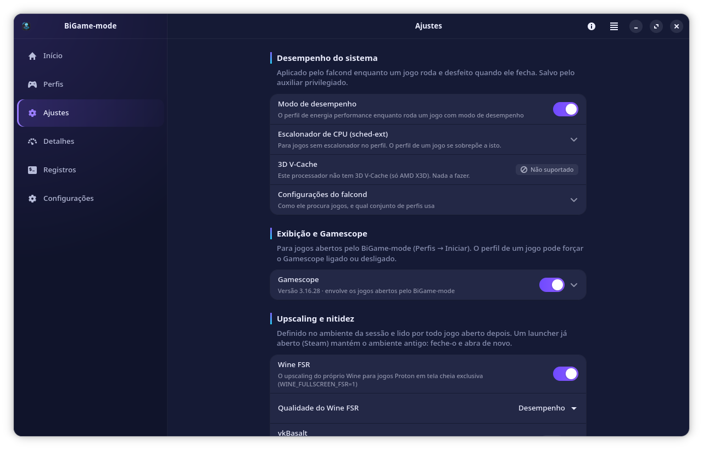
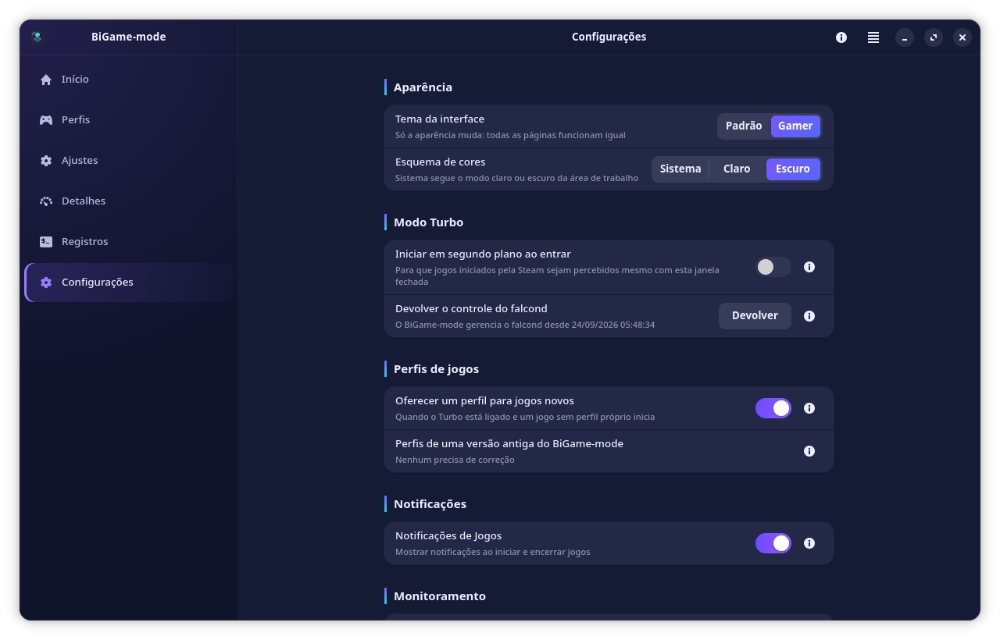
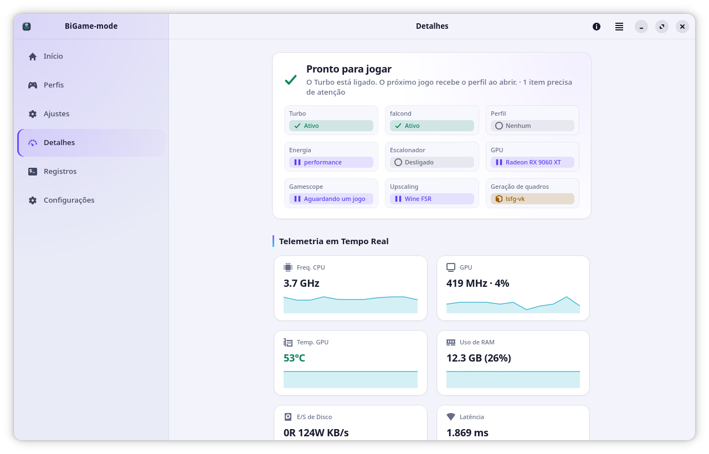
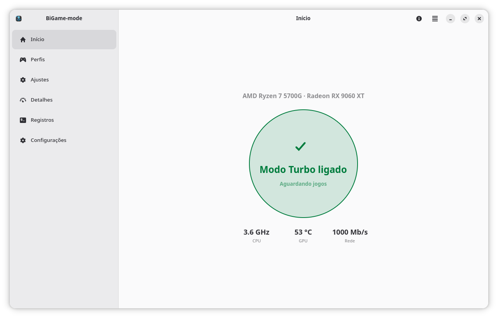

<div align="center">


# BiGame-mode

**O modo de jogo do BigLinux.**<br>
Turbo com um clique e um preset, perfis por jogo, Gráficos com IA e uma página
que mostra, com evidência, o que está mesmo em vigor.

[](https://github.com/ruscher/bigamemode)
[](LICENSE)
[](https://www.rust-lang.org/)
[](https://gnome.pages.gitlab.gnome.org/libadwaita/)
[](#-idiomas)

[Recursos](#-recursos) ·
[Capturas de tela](#-capturas-de-tela) ·
[Instalação](#-instalação) ·
[Benchmarks](#-benchmarks) ·
[Segurança](#%EF%B8%8F-segurança) ·
[Desenvolvimento](#%EF%B8%8F-desenvolvimento)

<br>

<picture>
  <source media="(prefers-color-scheme: light)" srcset="docs/screenshots/home-default-light.png">
  
</picture>

</div>

---

## 🎮 O que é

O BiGame-mode é a central de jogos do BigLinux. Com um botão, o **Turbo**, os
jogos passam a rodar com o perfil de desempenho certo, aplicado ao abrir e
desfeito ao fechar pelo [falcond](https://git.pika-os.com/general-packages/falcond).
O aplicativo mostra o que de fato está em vigor, mede se uma mudança ajudou e
cuida do que acontece *dentro* do jogo, como o upscaling e a geração de quadros,
sempre com backup e desfazer completos.

> [!NOTE]
> Uma regra atravessa o projeto: **nada é oferecido que a máquina não possa
> fazer, e nada é chamado de melhoria sem medição.**

## 🚀 Novidades da 2.2.0

- **Boas-vindas, Sobre e Ajuda refeitos.** Uma tela de boas-vindas com os
  recursos, o Sobre com a descrição, créditos e informações de depuração
  completas, e uma Ajuda passo a passo para cada página.
- **Ajustes mais claros.** O Gamescope fica sempre à vista, com os tamanhos
  escolhidos entre as resoluções padrão e a da tela principal detectada; cada
  opção técnica tem um ⓘ. O vkBasalt ganhou visuais: CAS ou o estilo
  **Nara Linux** (do Narayan), com os shaders do ReShade baixados só quando
  escolhido e conferidos pelo SHA-256.
- **Perfil do jogo igual aos Ajustes**, com as mesmas seções e linhas. Os
  valores próprios do jogo chegam a ele pelo **Iniciar (Turbo)**, pelas opções
  de inicialização da Steam ou pelas configurações do jogo no **Heroic**.
- **Iniciar (Turbo) em todos os lançadores** (Steam, Heroic, Lutris,
  Flatpak), e **Reabrir** para o lançador que estava aberto antes do preset,
  recusado enquanto um jogo dele roda.
- **Gráficos com IA redesenhados**: veredito primeiro, o porquê, o que fazer
  no jogo, opções legíveis com ⓘ, **Verificar de novo** e **Salvar escolha**.
  A análise segue o inicializador até o jogo real e reconhece upscalers
  embutidos no executável.
- **Detalhes**: fechar ou pausar programas em segundo plano (nunca os do
  sistema, da área de trabalho ou do jogo), aplicar um DNS medido como o
  principal, com backup e restauração, e escolher o alvo do ping entre os
  servidores medidos. **Registros** cobre todas as fontes de que o app
  depende. O controle do falcond pode ser devolvido e retomado.

<details>
<summary><b>Novidades da 2.1.0</b></summary>

- **Presets do Turbo.** Antes de ligar, escolha o que os jogos priorizam:
  **Padrão**, **Mais FPS**, **FPS cravado em 60** ou **Gráficos aprimorados**.
  Cada preset usa só o que os jogos leem de verdade e sai junto com o Turbo.
- **Nova Início.** Um botão power que se enche como um líquido nas cores do
  tema a cada etapa real do Turbo, CPU, GPU e rede ao vivo, e um card do jogo
  em execução com uma flag colorida por recurso. Tudo cabe na janela.
- **Ajustes, perfil do jogo e Assistente num só modelo**, com as mesmas seções
  e o que fica em "Configuração geral" seguindo os Ajustes. Toda colisão entre
  tecnologias (Wine FSR, upscaling do Gamescope, OptiScaler, lsfg-vk) é
  perguntada, nunca resolvida em silêncio.
- **Jogos da Steam recebem o Gamescope e o Wine FSR** pelas opções de
  inicialização, gravadas com a Steam fechada. Mudar os tamanhos do Gamescope
  nos Ajustes atualiza os jogos que o usam, e a Steam aberta ganha um botão
  para fechar, gravar e reabrir.
- **Detecção do jogo mais certeira.** O lançador de um jogo (a página do
  REDlauncher, atualizadores) não é mais tomado pelo jogo. O Gamescope e o
  vkBasalt são vistos também quando a Steam os coloca em volta do jogo.
- **Detalhes diz quando o falcond não aplica o perfil de um jogo, e por quê**
  (o falcond 2.0.2 não enxerga jogos que renomeiam a thread principal, como o
  Cyberpunk 2077; a correção veio no falcond 2.0.3).
- A revisão do perfil oferecido mostra a recomendação dos Gráficos com IA para
  a placa de vídeo, e o MangoHud ganhou estilos inspirados no Steam Deck.

</details>

## ✨ Recursos

<table>
<tr>
<td width="50%" valign="top">

### ⚡ Turbo

A chave principal. Desligado, o BiGame-mode não interfere em jogo nenhum.
Ligado, o falcond aplica o perfil de cada jogo (perfil de energia, escalonador
sched-ext, modo do 3D V-Cache, inibição de repouso) e restaura tudo quando o
jogo fecha.

Antes de ligar, escolha o que os jogos devem priorizar:

- **Padrão**: os Ajustes como estão.
- **Mais FPS**: sem limite de quadros e sem filtro de imagem. Os quadros
  vêm de baixar a resolução no jogo, com o Wine FSR ampliando.
- **FPS cravado em 60**: limite do DXVK e do VKD3D-Proton nos jogos do
  Proton; nos jogos nativos abertos pelo BiGame-mode, o limitador do MangoHud.
- **Gráficos aprimorados**: nitidez CAS do vkBasalt, FSR 4 onde a GPU tem e
  60 FPS para a imagem mais pesada rodar estável.

O preset vale enquanto o Turbo está ligado e sai com ele. Jogos com geração de
quadros são avisados: o limite conta os quadros exibidos, então eles
renderizam metade. A Steam aberta antes recebe o preset quando é reaberta, e a
Início oferece reabrir.

</td>
<td width="50%" valign="top">

### 🕹️ Perfis por jogo

Jogos do Steam, Lutris, Heroic e do menu de aplicativos (nativos e Flatpak).
Só aparecem os que estão mesmo instalados. Quando um jogo desconhecido abre com
o Turbo ligado, uma notificação oferece criar o perfil, com um assistente que
explica cada opção.

</td>
</tr>
<tr>
<td valign="top">

### 🤖 Gráficos com IA

Analisa o jogo que realmente roda (seguindo o inicializador do Unreal até o
executável do jogo): a API gráfica, o DLSS/XeSS/FSR que ele traz em DLL ou
embutido no executável, as DLLs de proxy, o anti-cheat e a GPU em que ele
renderiza. Mostra primeiro o veredito e o porquê, com um ⓘ em cada item, e o
que fazer no menu do próprio jogo. Só ao clicar em **Aplicar** ele instala o
OptiScaler com backup verificado ou eleva o FSR 3.1 ao FSR 4 pelo Proton.
Também oferece **Verificar de novo**, **Reparar**, **Restaurar** e
**Diagnosticar**.

</td>
<td valign="top">

### 🔍 Detalhes com evidência

Cada item diz se está **ativo**, **aguardando**, **configurado mas não
detectado**, **desligado**, **sem dependência** ou **não suportado**. Ao abrir
a linha, você vê o que isso significa, a evidência e a correção. A página
também traz telemetria em tempo real, um cartão por GPU e **Problemas**
classificados, com comandos para copiar.

</td>
</tr>
<tr>
<td valign="top">

### 🎛️ Ajustes honestos

Desempenho do sistema, exibição e Gamescope (tamanhos escolhidos entre as
resoluções padrão, com a da tela principal detectada), upscaling e nitidez
(Wine FSR e vkBasalt, com os visuais CAS e Nara Linux), geração de quadros
(lsfg-vk), overlay e opções avançadas, cada opção técnica com um ⓘ. O que a
máquina não pode fazer aparece como **não suportado** ou **dependência
ausente**, com o comando que resolve. Nunca aparece um controle quebrado.

</td>
<td valign="top">

### 📏 Medir a diferença

Compara o jogo com e sem otimizações em várias execuções alternadas e dá o
veredito com o teste t de Welch. Uma melhoria só é chamada assim quando
supera a variação.

</td>
</tr>
</table>

<details>
<summary><b>Tudo o que cada página faz</b></summary>

| Página | O que faz |
|---|---|
| **Início** | O **Turbo** e o seu preset, três leituras ao vivo (CPU, GPU, rede) e um card que resume o que o Turbo fez ou, com um jogo aberto, mostra o jogo (capa e nome vindos da biblioteca, de qualquer lançador) com uma flag colorida por recurso (perfil, escalonador, energia, Gamescope, upscaling, geração de quadros, MangoHud, vkBasalt, limite de FPS) e o relatório completo. Um lançador que já estava aberto antes do preset (Steam, Heroic, Lutris) e não o recebeu aparece com **Reabrir**, recusado enquanto um jogo dele roda. |
| **Perfis** | A biblioteca de jogos com capas (Steam, Lutris, Heroic, Flatpak e menu), busca e filtros. Cada perfil tem as mesmas seções e linhas dos Ajustes, só para aquele jogo; cada opção começa em "Configuração geral", que segue os Ajustes (o Perfil global). Os valores próprios do jogo (tamanhos e filtro do Gamescope, limite de FPS, Wine FSR, vkBasalt) chegam a ele onde podem chegar: pelo **Iniciar (Turbo)**, nas opções de inicialização da Steam ou nas configurações do jogo no Heroic, gravadas com o lançador fechado e sem tocar no que é seu. No menu ⋮ de cada jogo: **Iniciar (Turbo)** (direto ou pelo próprio lançador), **Criar com Assistente**, **Gráficos com IA**, **Medir a diferença** e **Restaurar os gráficos do jogo**. |
| **Ajustes** | A configuração geral, usada por todos os jogos: desempenho, exibição, qualidade de imagem, geração de quadros, monitoramento (com os estilos do MangoHud inspirados no Steam Deck) e avançado. Ligar uma tecnologia que colide com outra já ligada pergunta qual manter. Mudar os tamanhos do Gamescope atualiza as opções de inicialização da Steam dos jogos que o usam. |
| **Detalhes** | Visão geral (pronto para jogar, Turbo, falcond, perfil, energia, escalonador, GPU, Gamescope, upscaling, geração de quadros), telemetria em tempo real, um cartão por placa de vídeo (carga, clock, VRAM, temperatura, energia e qual renderiza o jogo), o desempenho e o pipeline de vídeo. Traz ainda os **Problemas**, a rede (com a comparação de servidores DNS, que pode tornar o escolhido o DNS da conexão pelo NetworkManager, guardando antes as configurações anteriores para **Restaurar**), a carga em segundo plano, as opções de lançamento da Steam quebradas e o relatório para suporte. |
| **Registros** | O que importa numa sessão de jogo: falcond, BiGame-mode e o helper, power-profiles-daemon, scx_loader, Gamescope, os drivers de GPU, as falhas (coredumps), as instalações pelo pkexec e, da saída dos jogos da Steam, o que vem do Proton/Wine, MangoHud, vkBasalt, lsfg-vk e OptiScaler, com filtro por fonte. |
| **Configurações** | A aparência (tema **Padrão** ou **Gamer**, claro, escuro ou o do sistema; uma instalação nova abre em Gamer escuro), o início em segundo plano, a oferta de perfis, as notificações, o alvo do ping (um dos servidores da comparação de DNS ou outro endereço) e o controle do falcond: **Devolver** o entrega exatamente como estava antes, e **Retomar o controle** volta a geri-lo, registrando de novo o estado em que ele está. |

Fechar a janela deixa o aplicativo na **bandeja**. A cor do ícone indica o
estado: azul quando ocioso, verde com um jogo otimizado e amarelo quando há
um aviso.

</details>

## 📸 Capturas de tela

<table>
<tr>
<td colspan="2"></td>
</tr>
<tr>
<td colspan="2" align="center"><b>Início</b> com um jogo aberto: cada recurso numa flag colorida, com o que está ativo e o que não está</td>
</tr>
<tr>
<td width="50%"></td>
<td width="50%"></td>
</tr>
<tr>
<td align="center"><b>Perfis</b>: a biblioteca de jogos instalados, cada um com seu perfil</td>
<td align="center"><b>Detalhes</b>: o que está em vigor, com a evidência</td>
</tr>
<tr>
<td></td>
<td></td>
</tr>
<tr>
<td align="center"><b>Ajustes</b>: o que a máquina não suporta aparece como tal</td>
<td align="center"><b>Configurações</b>: temas Padrão e Gamer, claro ou escuro</td>
</tr>
<tr>
<td></td>
<td></td>
</tr>
<tr>
<td align="center"><b>Tema Gamer claro</b></td>
<td align="center"><b>Tema Padrão claro</b></td>
</tr>
</table>

## ⚙️ Como funciona

- **O falcond cuida do desempenho do sistema.** Ele reconhece o jogo pelo nome
  do processo, aplica o perfil e restaura tudo quando o jogo fecha. O
  BiGame-mode liga e desliga o falcond (Turbo) e escreve os perfis que ele lê.
- **Cada ajuste tem um único dono.** O BiGame-mode não aplica por conta própria
  o que o falcond ou o power-profiles-daemon já aplicam. O GameMode da Feral
  não é usado, porque os dois disputariam os mesmos ajustes.
- **Duas tecnologias com a mesma função não rodam em série.** Num jogo com
  OptiScaler, o Wine FSR e o upscaling do Gamescope ficam desligados naquela
  execução. O lsfg-vk também fica desligado quando o OptiScaler gera os
  quadros. Ligar uma quando a outra já está ligada pergunta qual manter.
- **Um jogo da Steam é aberto pela Steam**, fora do alcance do BiGame-mode. O
  que o perfil pede para ele (Gamescope, Wine FSR desligado, MangoHud) vai para
  as opções de inicialização do jogo, gravadas com a Steam fechada, em todas as
  contas, e só o trecho que o BiGame-mode escreveu é trocado ou removido.
- **Os presets do Turbo ficam só na sessão em execução** (o gerenciador do
  systemd do usuário), nunca no `environment.d`, para saírem por completo
  quando o Turbo desliga.
- **Os Gráficos com IA detectam o que o jogo realmente usa** pela tabela de
  importação do executável, não pelo nome das DLLs, e reconhecem um upscaler
  compilado dentro do executável. Um jogo testado em que uma combinação trava
  fica registrado na lista de jogos (por exemplo, The Outer Worlds: Spacer's
  Choice Edition mantém o próprio FSR 2: o OptiScaler assume o FSR 2 dele,
  mas o FSR 3.1/FSR 4 trava o jogo sob o VKD3D-Proton). Eles nunca tocam jogos com
  anti-cheat e baixam o [OptiScaler](https://github.com/optiscaler/OptiScaler)
  da release oficial, por HTTPS e com SHA-256 fixado.
- **Cada instalação é uma transação**: backup verificado, diário, troca atômica
  e verificação. Uma instalação interrompida é desfeita na próxima abertura.
- O BiGame-mode **não redistribui binários de terceiros** nem baixa ou
  substitui DLLs da NVIDIA. A renderização neural em AMD (DLSS-NR-on-AMD) é
  detectada e explicada, mas nunca baixada, porque a licença não permite.

## 🛡️ Segurança

```text
┌─────────────────────────┐   D-Bus (sistema)   ┌─────────────────────────┐
│ bigame-ui    (usuário)  │ ──────────────────▶ │ bigame-daemon   (root)  │
│ GTK4 + libadwaita, tray │  cada chamada passa │ valida cada argumento;  │
│ Gráficos com IA,        │  pelo Polkit        │ perfis e config do      │
│ medições, registros     │                     │ falcond, Turbo, sysfs   │
└───────────┬─────────────┘                     └───────────┬─────────────┘
            │ lê o estado                                   ▼
            └──────────────────────────────▶ falcond ──▶ scx_loader,
                                             (perfis)    power-profiles-daemon
```

- **A interface nunca roda como root.** Só um pequeno auxiliar no barramento de
  sistema tem privilégios.
- **Nove métodos privilegiados**, cada um autorizado pelo Polkit antes de
  qualquer outra coisa (sem Polkit, o acesso é negado) e com cada argumento
  validado do lado root.
- **Escritas estreitas e atômicas.** Cada método escreve um único local
  conhecido, com `O_EXCL | O_NOFOLLOW`, nunca num caminho montado por quem
  chama. Perfis não aceitam `start_script`/`stop_script`.
- **Confinado pelo systemd.** `/sys` é somente leitura, exceto
  `/sys/devices`. Nenhum comando passa por shell.

Detalhes em [docs/SECURITY.md](docs/SECURITY.md) e
[docs/ARCHITECTURE.md](docs/ARCHITECTURE.md).

## 📦 Instalação

### BigLinux · Manjaro · Arch Linux

**1. Ative o repositório BigCommunity (community-extra).** O `falcond` e o
`lsfg-vk` vêm dele, e ele não vem ativado numa instalação padrão do BigLinux.
O `vkbasalt` vem do repositório do BigLinux (no Arch, do AUR).

```bash
sudo pacman-key --keyserver hkps://keyserver.ubuntu.com \
    --recv-keys AECEEE84E52BBFAA9F1C9DF01EA0CEEEB09B44A3
sudo pacman-key --lsign-key AECEEE84E52BBFAA9F1C9DF01EA0CEEEB09B44A3

sudo tee -a /etc/pacman.conf <<'CONF'

[community-extra]
SigLevel = PackageRequired
Server = https://repo.communitybig.org/extra/$arch
CONF

sudo pacman -Sy
```

**2. Compile e instale o BiGame-mode.**

```bash
sudo pacman -S --needed base-devel git
git clone https://github.com/ruscher/bigamemode.git
cd bigamemode
makepkg -si
```

O `makepkg` instala o que falta para compilar, compila, confere as traduções,
roda os testes e instala o pacote. O PKGBUILD compila a branch `main` do
GitHub, não as mudanças locais do clone.

Depois, abra **BiGame-mode** no menu de aplicativos.

> [!TIP]
> Ao atualizar, o auxiliar para e volta na próxima chamada, já com a versão
> nova. Ao remover, o falcond volta ao estado em que estava antes do
> BiGame-mode. Os arquivos que os Gráficos com IA colocaram em jogos continuam
> lá até **Restaurar os gráficos do jogo**. Os backups ficam em
> `~/.local/state/bigame-mode/graphics`.

### Dependências

| Pacote | Por quê |
|---|---|
| `gtk4`, `libadwaita`, `glib2`, `hicolor-icon-theme` | interface |
| `dbus`, `polkit`, `systemd` | o auxiliar root: serviço no barramento de sistema, iniciado pelo systemd, com cada ação autorizada pelo Polkit |
| `falcond`, `power-profiles-daemon` | desempenho por jogo e perfil de energia |
| `scx-tools`, `scx-scheds` | o `scx_loader`, com que o falcond troca o escalonador de CPU durante o jogo, e os escalonadores |
| `gamescope`, `mangohud`, `vkbasalt` | o que os ajustes por jogo e de lançamento ligam; o MangoHud também captura os frametimes das medições |
| `lsfg-vk` | geração de quadros (Lossless Scaling) por jogo; só gera quadros com o seu próprio `Lossless.dll`, que nunca vem no pacote |
| `curl`, `libarchive` | baixar e extrair o OptiScaler |
| `hwdata`, `pciutils` | identificar a placa de vídeo |
| `iputils`, `iproute2` | latência e fila de rede |

**Opcional:** `nvidia-utils` fornece a telemetria em placas NVIDIA, pela
biblioteca NVML. Só serve a placas NVIDIA e conflita com os pacotes dos
drivers NVIDIA antigos. `networkmanager` permite trocar o DNS da conexão a
partir da comparação de DNS; sem ele a opção aparece indisponível, com o
motivo.

Os lançadores **não** são dependências: o BiGame-mode encontra os jogos do
Steam, do Lutris e do Heroic que estiverem instalados, nativos ou em Flatpak.

O pacote instala o `bigame-ui` (o aplicativo, que roda como usuário comum) e o
`bigame-daemon` (o auxiliar root), com sua unit do systemd, os arquivos de
D-Bus e a política do Polkit. Instala também o `.desktop`, o metainfo, os
ícones e as traduções.

## 💻 Compatibilidade

| | |
|---|---|
| **Sistema** | BigLinux e derivados do Manjaro/Arch, com systemd e o falcond do repositório BigCommunity. Recomenda-se o falcond 2.0.3 ou mais novo: o 2.0.2 não aplica o perfil a jogos que renomeiam a thread principal (Cyberpunk 2077), e Detalhes avisa quando isso acontece |
| **Área de trabalho** | Testado no KDE Plasma (Wayland). No GNOME, o ícone da bandeja depende de uma extensão AppIndicator |
| **Jogos** | Steam (incluindo Proton), Lutris, Heroic e jogos nativos do menu de aplicativos, nativos ou Flatpak |
| **GPUs** | AMD, NVIDIA e Intel, inclusive notebooks híbridos (a GPU em que o jogo renderiza é identificada, com PRIME offload) |
| **Testado em** | AMD Ryzen 7 5700G com Radeon RX 9060 XT (RDNA 4) e a Radeon Vega integrada; notebook híbrido com Intel HD 630 e GeForce GTX 1050 Ti (driver NVIDIA 580); máquina virtual com BigLinux padrão (instalação do zero, sem aceleração 3D) |
| **Detectado, ainda não testado em hardware real** | RDNA 3, RTX, Intel Arc, CPUs híbridas, 3D V-Cache, notebooks na bateria, X11, VRR e HDR. Nessas máquinas, o BiGame-mode oferece só o que detectar como suportado |

## 📊 Benchmarks

**Presets do Turbo** (2.1.0, uma execução por configuração, com o benchmark do
próprio jogo e a potência lida do sensor da GPU):

| Jogo | Padrão | Com preset |
|---|---|---|
| SuperTuxKart (nativo, aberto pelo BiGame-mode) | 455 FPS típicos, GPU a 53 W | **FPS cravado em 60**: 60 típicos, 59 estáveis, GPU a **31 W** |
| Cyberpunk 2077 (traçado de raios ultra) | 37,5 FPS | **Gráficos aprimorados**: 37,3 FPS, com o vkBasalt e o provedor do FSR 4 carregados no jogo |
| Shadow of the Tomb Raider, com geração de quadros do OptiScaler | 62,5 FPS | **FPS cravado em 60**: 30 FPS renderizados (60 na tela), o motivo do aviso sobre geração de quadros |

O limitador próprio do Gamescope (`-r`, `--framerate-limit`) não segurou o
SuperTuxKart com o V-Sync do jogo desligado (570 FPS apresentados); por isso,
nos jogos nativos, o limite é o do MangoHud.

**Resultados anteriores:**


Medido com o benchmark do próprio **Shadow of the Tomb Raider** (3440×1440, três
execuções alternadas por configuração, diferença exigida acima da variação e
no teste t de Welch a 95 %):

| Configuração | FPS médio | |
|---|---:|---|
| TAA nativo do jogo | 89,8 | `████████████████████░░` |
| XeSS Quality do próprio jogo | 94,2 | `█████████████████████░` **+4,9 %** |
| **FSR via OptiScaler (Gráficos com IA)** | **98,8** | `██████████████████████` **+10,1 %** |

- **Cyberpunk 2077**, que traz o FSR 3.1 da AMD: o FSR 4 pelo Proton (uma
  opção de execução, nenhum arquivo) rendeu o mesmo que o FSR 3.1 (38,4 → 38,2,
  sem diferença, duas execuções por configuração). O OptiScaler ficou 6,4 %
  **mais lento**, por isso ali o recomendado é o FSR do próprio jogo.
- **Nível de energia da GPU:** fixar a GPU no nível `high` deixou os jogos
  7,5–8,3 % **mais lentos**. Perfil de energia, governador e escalonadores
  sched-ext não mudaram nada, por isso o BiGame-mode não os força.
- **Geração de quadros:** o lsfg-vk custou 42 % dos quadros renderizados em x2
  (88,9 → 51,8) e 55 % em x3, por isso nunca é ligado sozinho.

Método e todos os resultados em [docs/BENCHMARKS.md](docs/BENCHMARKS.md). O
relatório e as métricas de cada sessão ficam em `bigame-engine/benchmarks/`; as
capturas brutas, no histórico (tag `benchmarks-raw-data`).

## 🌍 Idiomas

O BiGame-mode é escrito em inglês e está traduzido para **29 idiomas**:

> alemão · búlgaro · chinês · coreano · croata · dinamarquês · eslovaco ·
> espanhol · estoniano · finlandês · francês · grego · hebraico · holandês ·
> húngaro · inglês · islandês · italiano · japonês · norueguês · polonês ·
> português · português do Brasil · romeno · russo · sueco · tcheco · turco ·
> ucraniano

O idioma segue o do sistema. Os catálogos ficam em [`locale/`](locale).
Correções e novos idiomas são bem-vindos.

## 🛠️ Desenvolvimento

Requer Rust 1.85 ou mais novo, GTK 4.14+, libadwaita 1.7+ e
`glib-compile-resources`.

```bash
cd bigame-engine
cargo build --workspace
cargo test --workspace
cargo clippy --workspace --all-targets -- -D warnings   # lints pedantic
./target/debug/bigame-ui
./target/debug/bigame-ui --diagnostics     # relatório de suporte no terminal
```

O código é um workspace Rust em `bigame-engine/`:

| Crate | Papel |
|---|---|
| `bigame-core` | toda a lógica, sem interface: detecção, perfis, Turbo, Gráficos com IA, telemetria, medições |
| `bigame-ui` | o aplicativo GTK4/libadwaita e o ícone da bandeja |
| `bigame-daemon` | o auxiliar root no D-Bus, autorizado pelo Polkit |

- Sem o pacote instalado, a interface roda, mas o que exige root (perfis,
  Turbo, configuração do falcond) fica indisponível.
- `tests/daemon-authorization.sh` confere que o auxiliar recusa todas as ações
  privilegiadas quando o Polkit não está disponível.
- `bigame-core/examples/` traz ferramentas de linha de comando: detecção
  (`detect`, `library`, `running`, `health`), Gráficos com IA (`graphics_scan`,
  `graphics_plan`, `graphics_apply`, `graphics_status`,
  `graphics_capabilities`, `graphics_diagnose`, `graphics_native`), Turbo e
  Booster (`turbo`, `turbo_preset`, `booster_run`, `measure`), quem controla o
  falcond (`falcond_control`), o comando que o lançador monta (`launch_plan`),
  um jogo iniciado pelo próprio lançador (`launch_through`), os ajustes de um
  jogo gravados no Heroic (`heroic_apply`), o Gamescope de um jogo nas opções
  de lançamento da Steam (`steam_gamescope`), o estilo do vkBasalt
  (`vkbasalt_style`), lsfg-vk (`lsfg`) e relatórios de benchmark
  (`bench_report`, `bench_native_report`). Rode com
  `cargo run -p bigame-core --example <nome>`.
- `bigame-engine/scripts/clean-dev.sh` mostra o que a árvore guarda além do
  código (`--analyze`, o padrão) e remove só o que um build recria
  (`--safe`: `target/`, `src/` e `pkg/` do makepkg, pacotes gerados). Com
  `--deep`, também tira da árvore os dados brutos de benchmark, para
  `~/.local/share/bigame-mode/benchmarks/raw`. Nunca apaga arquivo rastreado
  nem um clone aninhado, e nada fora da árvore. Veja
  [docs/STORAGE-AUDIT.md](docs/STORAGE-AUDIT.md).

<details>
<summary><b>Traduções</b></summary>

Todo texto visível passa por `i18n`/`ni18n` na interface e por `N_` no
`bigame-core`. Depois de mudar textos no código:

```bash
python3 locale/extract-strings.py        # atualiza locale/bigame-mode.pot
for po in locale/*.po; do
    msgmerge -U --no-wrap --no-fuzzy-matching "$po" locale/bigame-mode.pot
done
```

O extrator recusa rodar se um arquivo com textos faltar em
`locale/POTFILES.in`, e o build falha se o template estiver desatualizado.

</details>

## 👤 Autor

<table>
<tr>
<td>

**Rafael Ruscher** · <rruscher@gmail.com>

Eu, **Rafael Ruscher**, sempre fui apaixonado por jogos. Sou um grande
entusiasta e, principalmente, um defensor ferrenho de jogos no Linux. Nos
últimos anos, vimos o jogo virar: com as melhorias constantes e o apoio
massivo da **Valve**, a compatibilidade hoje é quase total.

Fico extremamente feliz em poder jogar com amigos como o **Barnabé di
Kartola**, e acompanhar a turma do **Alessandro** e do **Pacheco** do canal
**System Infotech**. Eles jogam diariamente e, sempre que me sobra um
tempinho, estou lá jogando com eles. Ver canais mostrando o **BigLinux** em
ação me motiva profundamente.

Em respeito a essa comunidade e para garantir que todos tenham a melhor
experiência possível, criei o **BiGame-mode**. O objetivo é aproveitar o
máximo do hardware, trazendo os últimos recursos tecnológicos para alcançar o
FPS máximo. Com a integração do `lsfg-vk` (Lossless Scaling) e o `falcond`,
criamos uma solução completa de GameMode para o ecossistema BigLinux.

**Agradecimentos:** Bruno Gonçalves, Barnabé di Kartola, Alessandro e Pacheco
(System Infotech) e a comunidade BigLinux.

</td>
</tr>
</table>

## 🙏 Projetos utilizados

O BiGame-mode se apoia em projetos de terceiros, cada um com seus autores e
licenças:

- **Sistema:** [falcond](https://git.pika-os.com/general-packages/falcond)
  (PikaOS), [sched-ext](https://github.com/sched-ext/scx) e `scx_loader`,
  power-profiles-daemon, systemd, D-Bus e Polkit.
- **Jogos e gráficos:** [OptiScaler](https://github.com/optiscaler/OptiScaler),
  Gamescope e Proton (Valve), DXVK, VKD3D-Proton,
  [lsfg-vk](https://github.com/PancakeTAS/lsfg-vk), MangoHud e vkBasalt. O
  visual **Nara Linux** do vkBasalt é do Narayan, do canal
  [Nara Linux](https://www.youtube.com/watch?v=GGBC-qMB_0Y), e usa shaders do
  [ReShade](https://github.com/crosire/reshade-shaders) e do
  [SweetFX](https://github.com/CeeJayDK/SweetFX), baixados só quando esse
  visual é escolhido, em versões fixas conferidas pelo SHA-256. DLSS,
  XeSS e FSR pertencem a NVIDIA, Intel e AMD e seguem as licenças delas.
- **Aplicativo:** Rust, GTK e libadwaita (GNOME), gtk4-rs, zbus, Tokio, Serde,
  ksni e gettext.

## 📄 Licença

Distribuído sob a **GPL-3.0-or-later**. Veja [LICENSE](LICENSE).

<div align="center">
<sub>Feito com 🎮 para a comunidade <b>BigLinux</b>.</sub>
</div>
